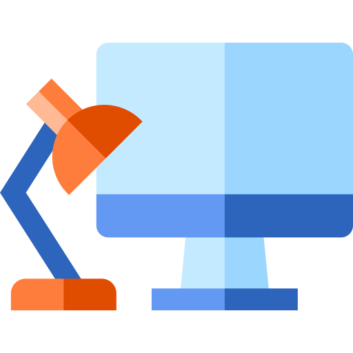

<a href="https://manishsingh10895.github.io/workspace-manager">
    
</a>

# Introduction

## Getting Started

Clone this repository locally :

``` bash
git clone https://github.com/maximegris/angular-electron.git
```

Install dependencies with npm :

``` bash
npm install
```

There is an issue with `yarn` and `node_modules` that are only used in electron on the backend when the application is built by the packager. Please use `npm` as dependencies manager.


If you want to generate Angular components with Angular-cli , you **MUST** install `@angular/cli` in npm global context.
Please follow [Angular-cli documentation](https://github.com/angular/angular-cli) if you had installed a previous version of `angular-cli`.

``` bash
npm install -g @angular/cli
```

## To build for development

- **in a terminal window** -> npm start

Voila! You can use your Angular + Electron app in a local development environment with hot reload !

The application code is managed by `main.ts`. In this sample, the app runs with a simple Angular App (http://localhost:4200) and an Electron window.
The Angular component contains an example of Electron and NodeJS native lib import.
You can disable "Developer Tools" by commenting `win.webContents.openDevTools();` in `main.ts`.

## Download for MacOS
You can download just the application for MacOS 
[Download for Mac](https://github.com/manishsingh10895/workspace-manager/releases/download/v0.0.1-beta-mac/workspace-manager-6.0.1.dmg)


## Included Commands

|Command|Description|
|--|--|
|`npm run ng:serve:web`| Execute the app in the browser |
|`npm run build`| Build the app. Your built files are in the /dist folder. |
|`npm run build:prod`| Build the app with Angular aot. Your built files are in the /dist folder. |
|`npm run electron:local`| Builds your application and start electron
|`npm run electron:linux`| Builds your application and creates an app consumable on linux system |
|`npm run electron:windows`| On a Windows OS, builds your application and creates an app consumable in windows 32/64 bit systems |
|`npm run electron:mac`|  On a MAC OS, builds your application and generates a `.app` file of your application that can be run on Mac |